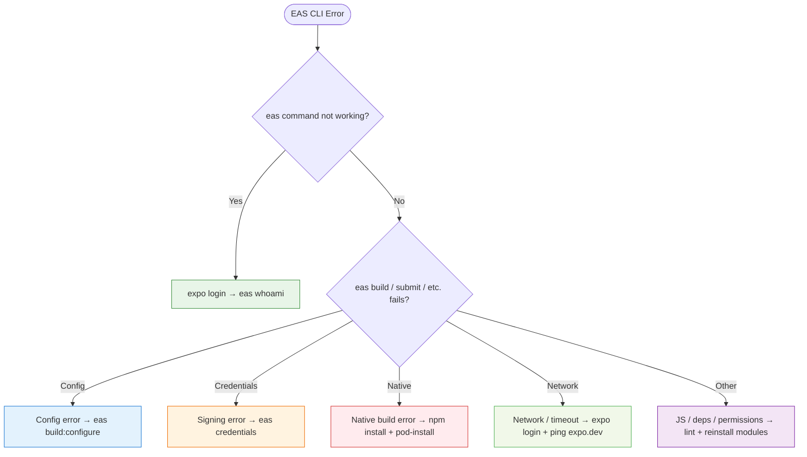

# EAS Build Guide

This guide describes how to perform three types of builds with **EAS (Expo Application Services)**: cloud builds, local builds, and iOS builds. This is suitable for beginners and other developers who want to get started quickly.

There are 3 build profiles available: `preview`, `development`, and `production` which can be configured in the `eas.json` file.

* `preview`: For quick tests and internal distribution `APK` or `IPA`.
* `development`: For extensive testing with debug options `APK` or `IPA`.
* `production`: For app store distribution `AAB` or `IPA`.

---

## Preparation

1. Make sure you have EAS CLI installed:

```bash
npm install -g eas-cli
```

2. Ensure your project is configured for EAS Build:

```bash
eas build:configure
```

This creates an `eas.json` file in your project folder.

* This file contains the build profiles and settings for EAS Build.

  * Modify this file according to your preferences if necessary.

---

## Building with EAS

### Cloud Build (Managed)

Cloud builds use the Expo servers to build your app. This is convenient because no local configuration is required.

You will need an EAS account, which you can create for free at [expo.dev/signup](https://expo.dev/signup).

If you want to perform an iOS build, you need an Apple Developer account [https://developer.apple.com/programs](https://developer.apple.com/programs/).

#### Steps

1. Open the terminal in your project folder.
2. Log in to EAS:

```bash
npx eas login
```

Enter your email and password.

3. Start the cloud build:

```bash
npx eas build --platform android --profile preview
```

This will build the app in the cloud for Android using the `preview` build profile.

Or for iOS:

```bash
npx eas build --platform ios --profile production
```

This will build the app in the cloud for iOS using the `production` build profile.

4. Choose the build profile when prompted (for example `preview`, `production`, or `development`).
5. EAS will show a link where you can monitor the build status.

#### Example terminal output:

```bash
✔ Logged in as user@example.com
✔ Using project at /path/to/project
? Choose the build profile › preview
✔ Build queued. You can monitor the build at:
https://expo.dev/accounts/username/projects/project/builds/xyz

...

=== build in progress ===
✔ Build finished successfully!
✔ Download the build artifacts:
https://expo.dev/accounts/username/projects/project/builds/xyz/artifacts
```

---

### Local Build

With a local build, the app is built on your own computer. Useful for quick tests and process control.

#### Steps:

1. Ensure the correct tools are installed:

   * Android: Android Studio / SDK [https://developer.android.com/studio](https://developer.android.com/studio)
   * iOS: macOS + Xcode (for local builds) [https://developer.apple.com/xcode/](https://developer.apple.com/xcode/)
2. Start the local build:

```bash
npx eas build --platform android '--local' --profile preview 
npx eas build --platform ios '--local' --profile preview
```

You can rename the file afterward using F2.
3. The build runs locally and the result is in the `./build` folder of your project.

#### Example terminal output:

```bash
✔ Using project at /path/to/project
✔ Starting local build
✔ Preparing build environment
✔ Installing dependencies
✔ Building Android app locally
✔ Build finished successfully!
✔ Output: /path/to/project/build/app-release.aab
```

---

### iOS Build (Cloud)

iOS builds require extra steps due to Apple certificates and provisioning profiles.

#### Steps:

1. Open the terminal in your project folder.
2. Start the build:

```bash
npx eas build --platform ios --profile production
```

3. Follow the prompts:

   * Apple ID and password
   * Two-factor authentication code
   * Choose a provisioning profile (EAS can handle this automatically)
4. EAS will start the cloud build and provide a link to monitor the status.

#### Example terminal output:

```bash
✔ Using project at /path/to/project
? Choose the build profile › production
? Apple ID: user@apple.com
? Password (app-specific or Apple ID): ********
? Two-factor code: 123456
✔ Using existing provisioning profile
✔ Build queued. Monitor here:
https://expo.dev/accounts/username/projects/project/builds/abc
```

---

# Tips:

* Use `--clear-cache` if you have issues with old files.

* For local iOS builds, **macOS is required**.

  * For iOS cloud builds, an Apple Developer account is required.
  * You can build in the cloud without macOS.

* For Android, you can build both in the cloud and locally.

  * Local builds require the Android SDK.
  * Cloud builds do not require a local SDK.

* Save output files (.apk, .aab, .ipa) in a central location for distribution or upload to app stores.

  * You can easily rename the file afterward using F2.

## Table of build commands

`cloud builds`

| Goal | Platform    | Command | Notes |
| ---- | ----------- | ------- | ----- |
| Developer build (cloud)  | iOS/Android | `eas build --profile development --platform ios/android` | For debugging, device testing, often with dev clients |
| Preview build (cloud)    | iOS/Android | `eas build --profile preview --platform ios/android`     | For testers, without full release signing             |
| Production build (cloud) | iOS/Android | `eas build --profile production --platform ios/android`  | App-store builds with all signing requirements        |

`local builds`

| Goal | Platform  | Command  | Notes |
| ---- | --------- | -------- | ----- |
| Developer build (local)  | iOS/Android | `eas build --local --profile development --platform ios/android` | Local debug build, great for quick iteration |
| Preview build (local)    | iOS/Android | `eas build --local --profile preview --platform ios/android`     | Same as cloud preview, but compiled locally  |
| Production build (local) | iOS/Android | `eas build --local --profile production --platform ios/android`  | Compile a full production build locally      |

❗These are the classic build commands. You can also add extra flags like `--clear-cache` or `--non-interactive` depending on your needs.

`--clear-cache`: clears the build cache to avoid issues with old files. Essentially a clean build.
`--non-interactive`: for automated scripts without prompts, provides less terminal info.

---

## Troubleshooting

### EAS-CLI Debug Flowchart

Below is a visual flowchart for debugging EAS errors:



### EAS CLI – All Commands per Category (Cheat Sheet)

| Category | Common Issues | Commands (copy-paste) |
| -------- | ------------- | --------------------- |
| Login / Auth         | Not logged in, token expired                | `expo login` `eas whoami` `expo logout && expo login`                        |
| Config               | eas.json missing, wrong profile             | `eas build:configure`  `eas build:configure --profile preview`               |
| Credentials          | Certificates/keystore expired               | `eas credentials` `eas credentials --platform ios` `eas credentials --clear` |
| Start Build          | Platform or profile not specified           | `eas build --platform android` `eas build --platform ios` `eas build -p all` |
| Native Errors        | Gradle / CocoaPods / node_modules corrupted | `npm install`  `cd ios && npx pod-install`  `eas build --clear-cache`        |
| Network / Timeout    | VPN/firewall blocks expo.dev                | `ping expo.dev` `curl https://expo.dev` `expo login`                         |
| Corrupt Dependencies | Lockfile or node_modules broken             | `rm -rf node_modules` `rm -rf package-lock.json yarn.lock` + `npm install`   |
| Permissions          | No access to node_modules (macOS/Linux)     | `sudo chown -R $USER node_modules`                                           |
| Update CLI           | Old EAS CLI version                         | `npm install -g eas-cli`  `eas --version`                                    |
| Clear Cache          | Strange errors due to old cache             | `eas build --clear-cache`                                                    |
| Submit App           | Submit to stores after build                | `eas submit --platform ios` `eas submit --platform android`                  |

Copy the row you need → paste into terminal → done.

---

## More Information

For more information, visit the [EAS Build documentation](https://docs.expo.dev/build/introduction/).
